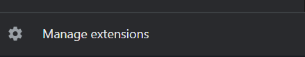
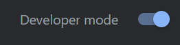
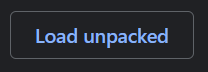

# gen-ai

### Clone the repository
```
git clone https://github.com/deagleSC/gen-ai.git
```

### Navigate to backend folder
```
cd backend
```

### Install dependancies
```
npm install
```

### Start the server
```
npm start
```

### Go to "Manage Extensions"


### Turn on Developer mode


### Select "Load unpacked"


Use the GenAI chrome extension from your extensions menu.
